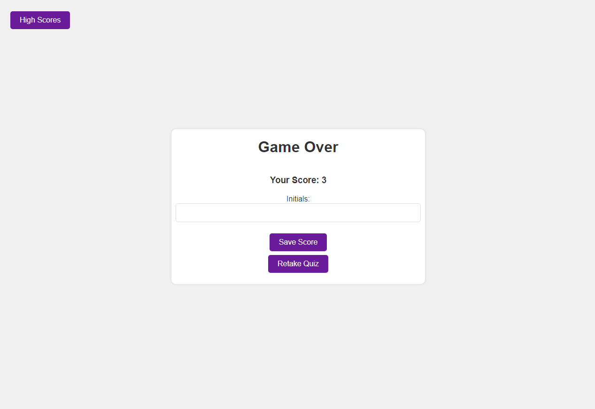

# Code Quiz

## Description

This is a dynamic, web-based quiz application that uses HTML, CSS, and JavaScript. The application presents users with a series of coding-related questions and tracks their score based on the speed and accuracy of their responses.

## Table of Contents

1. [Features](#features)
2. [Installation](#installation)
3. [Usage](#usage)
4. [Contribution](#contribution)
5. [License](#license)
6. [Questions](#questions)

## Features

* Fully responsive design for optimal viewing on any device.
* Countdown timer that penalizes users for incorrect answers by subtracting from the remaining time.
* High score system that allows users to save their score and initials to local storage.

## Installation

1. Clone the repository to your local machine using the command `git clone https://github.com/liq543/code-quiz.git`.
2. Open the `index.html` file in your browser.

## Usage

1. Click the 'Start Quiz' button to begin.
2. Select your answer to each question before the timer runs out.
3. At the end of the quiz, enter your initials and save your score.

## Contribution

This project is not open for contributions at this time.

## License

This project is licensed under the terms of the MIT License. See the [LICENSE](LICENSE) file for details.

## Questions

For any additional questions or comments, please contact me at:

* [GitHub](https://github.com/liq543)
